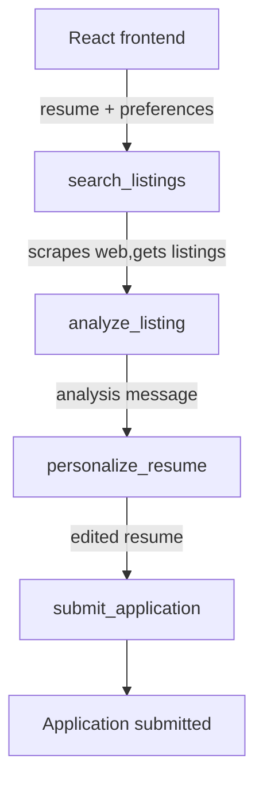

# General Idea of this Project

The goal of this project is to create an agentic web automation tool that applies to internships for the user, with minimal interaction.

## Capabilities

- Be able to accept a resume
- Optional cover letter
- Various parameters for job listings such as location, pay, hours, or time of year. The parameters should be enterable through plain text.

## Tools

Each of these tools is explained in more detail in TOOLS.md

- search_listings: an agent uses the user's credentials to search through listings on various sites.

- analyze_listing: an agent examines the listing and the company to decide what values and expertise the hiring company is looking for.

- personalize_resume: an agent uses the analysis from the previous tool to edit the user's resume to highlight specific skills in more detail to fit the listing

- submit_application: the updated resume is used to submit an application to the current job.

## Architecture

For all llm calls, we will be using the Groq API, specifically the Llama 3.3 70B model.

The flow from user input to a submitted application is as follows:

